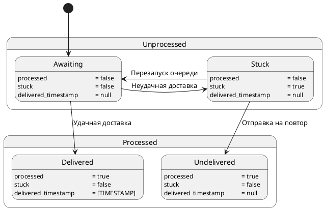

# e2

e2 Integration

## Очереди

### Состояния элементов очередей

## Взаимодействие с сервером e2

В настоящее время взаимодействие с сервером происходит через
rest-подобный api. Все обращения должны осуществляться HTTP-методом
POST, в теле сообщения должен передаваться XML.

Основным URL для взаимодействия является `/post` (или его псевдоним
`/agr`, который исчезнет в будущих версиях). Тип сообщения определяется
на основании корневого тега из XML-содержимого сообщения. Таким образом,
для любого взаимодействия с сервером e2 можно использовать единую точку
доступа.

Кроме `/post` имеется 2 специализированных URL:

* `/request`: ожидает сообщения с тегами `listRequest` и
  `elementRequest`;
* `/update`: ожидает сообщения с тегом `updateRequest`.

Эти дополнительные URL выполняют проверку, что полученный тег
соответствует точке входа. В случае несоответствия обработка прерывается
и сервис вернёт ошибку.

## Процесс конвертации сообщения

## Как обрабатывается имя системы из сообщения

## Инициализация новой конфигурации (первое приближение)

Jar-файл конфигурации лежит в определённом месте (пока не в базе). При
запуске сервера стартует бин `ConfigurationManager`. Его метод
`afterPropertiesSet()` запускает метод `updateConfiguration`, отвечающий
за инициализацию конфигурации.

Создаётся новый класс-лоадер, которому передаётся путь к jar-файлу
конфигурации. Выполняется создание нового экземпляра `Configuration4E2`.

В конце процесса новый экземпляр конфигурации заменяет старый, новые
процессы теперь будут получать его.